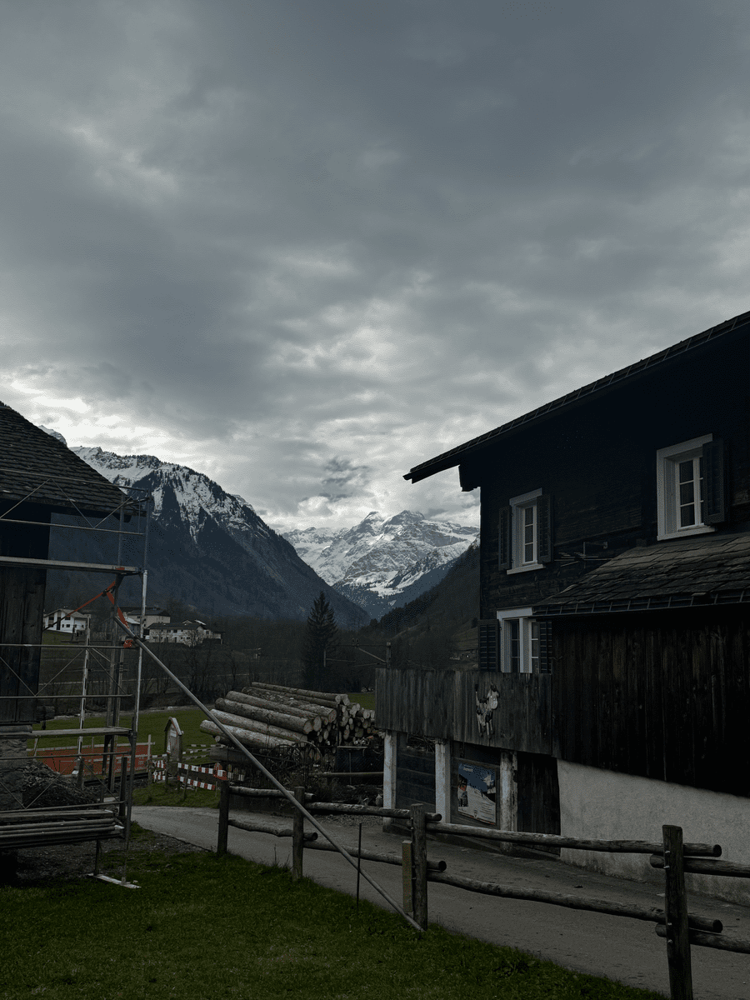

+++
title = "Das Märchen vom bösen Wolf"
date = "2024-03-28"
draft = false
pinned = false
tags = ["Lilo", "Example"]
image = ""
description = "In diesem Artikel werden Möglichkeiten aufgezeigt für das Verfassen von Blogeinträgen."
footnotes = "In der Fusszeile können zum Beispiel Bildquellen angegeben werden. Dieser Text ist abgetrennt durch eine Linie und etwas kleiner."
+++
# Das Märchen vom bösen Wolf


Mit der Wiederansiedelung des Wolfes in der Schweiz entsteht zugleich ein grosser Konflikt zwischen den Bestrebungen der Tierschützer und der Angst und Verzweiflung der Bergbevölkerung. Die Debatte um den Wolf in der Schweiz spitzt sich immer weiter zu.

Eine Reportage von Raiarii Waber und Finn Stäuble

Nach vier Stunden Zugfahrt kommen wir in Luchsingen im Kanton Glarus an. Die frische Bergluft strömt uns in die Nase. Vor uns bäumen sich die hohen, mächtigen Berge auf, während die Sonne nur vereinzelt durch die Wolken dringt. Das beruhigende Geräusch eines Rassenmähers im Hintergrund begleitet uns auf dem Weg zu unserem heutigen Gesprächspartner. Als wir die gemütliche Wohnung von Reto Glarner betreten, kommt uns der Geruch von frischem Kaffee entgegen. Er ist Herdenschutzbeauftragter im Kanton Glarus und ist in der Bauerngruppe Glarus Süd tätig. Er betreibt einen landwirtschaftlichen Betrieb mit eigenen Tieren. Der Wolf ist auf Gemeindegebiet sehr präsent und hat grossen Einfluss auf den landwirtschaftlichen Betrieb. Wie Reto Glarner sagt: «Es ist einfach eine enorme zusätzliche Arbeit, die man da macht». 

## Der Wolf in der Schweiz

Im 19. Jahrhundert wurde der Wolf in der Schweiz vollends ausgerottet. Seit 1995 wandern wieder Wölfe in die Schweiz ein. Heute sind es schon über 30 Rudel. Dies zur Freude von Umwelt- und Tierschützern, denn der Wolf sei, wie auch der Tierschützer und Leiter der Gruppe Wolf Herr Gerke meint, sehr wichtig. Er sei ein integraler Bestandteil des Ökosystems und insbesondere für die natürliche Regulierung der Pflanzenfresser relevant – und damit für einen gesunden Wald. 
Seit der Einwanderung der Wölfe sind allerdings immer mehr Risse an Nutztieren zu verzeichnen. Dies löst Wut und Angst bei den Leuten in den betroffenen Gebieten aus. 
Während die Tierschützer eher auf Herdenschutzmassnahmen setzen, fordert die vom Wolf betroffene Bevölkerung vermehrte Abschüsse von Wölfen. 



- - -

## Abschussgesetz

Seit dem 1. Dezember 2023 gilt der präventive Abschuss von Wölfen als zulässig. Zuvor durfte man den Wolf nur unter der Bedingung abschiessen, dass er schon Schaden angerichtet hat. Das überarbeitete Jagdgesetz erlaubt es den Kantonen, den Wolfsbestand zu regulieren, schon bevor Schaden angerichtet wird. Denn wie auch Reto Glarner sagt, sei es schlicht eine Sisyphus-Arbeit, in der freien Wildbahn denjenigen Wolf zu erkennen, welcher das letzte Mal Nutztiere gerissen hat. Mit der neuen Regelung sei man einen Schritt in die richtige Richtung gegangen, dennoch reiche das überarbeitete Gesetz nicht aus, meint Reto Glarner. Es brauche ein Regulieren, damit das Problem nicht überborde, und der Wolf sei deshalb nicht unmittelbar vom Aussterben bedroht. Tatsächlich werden die Populationszahlen der Wölfe von Jahr zu Jahr immer höher.
Für den Tierschützer David Gerke ist die neue Regelung jedoch willkürlich und faktenfrei. Wie Zahlen zeigen, sind die Risse vom Wolf an Nutztieren zum Vorjahr tatsächlich massiv gesunken. Ebenfalls werden die Risse des Wolfs pro Kopf immer weniger. Diese rückläufigen Zahlen der gerissen Nutztiere begründet der Tierschützer mit folgender Aussage: «Je länger es schon Wölfe in einem Gebiet gibt, desto geringer werden die Schäden, weil man lernt, mit dem Wolf umzugehen».

## *«Je länger es schon Wölfe in einem Gebiet gibt, desto geringer werden die Schäden, weil man lernt, mit dem Wolf umzugehen»*

Zu unserer Frage welche Gründe es haben könnte, dass die Risse an Nutztieren zum Vorjahr gesunken sind, meint der Landwirtschaftskommissar Reto Glarner, dass es sehr schwierig sei, wenn man jährlichen Vergleiche anstelle. "Zu sagen, dass das Konzept 2023 das richtige war, weil wir weniger Schäden haben, ist einfach zu kurz gegriffen", betont er. Als man noch im Vorjahr den ganzen Sommer lang geglaubt habe, einen Weg gefunden zu haben, habe es ein Jahr später nicht mehr funktioniert, fügt er an. Trotzdem meint Reto Glarner, dass der Herdeschutz gewiss ein Faktor für die gesunkenen Risse sei, aber man ihn nicht überbewerten dürfe. Dann fügt er hinzu: «Ich glaube auch, dass es sehr viel mit Zufall zu tun hat, ob ein Ereignis stattfindet oder ob es nicht stattfindet». Dabei spiele das Wetter und die Umgebung eine grosse Rolle. 


*«Ich glaube auch, dass es sehr viel mit Zufall zu tun hat, ob ein Ereignis stattfindet oder ob es nicht stattfindet.»*


Der Tierschützer David Gerke sieht das anders. Er ist zwar einverstanden, dass mehrere Faktoren die Zahl der Risse beeinflussen, aber findet es schlicht falsch, den Rissrückgang auf das Wetter rückzuführen. In unserem schriftlichen Interview schreibt er, dass die durchschnittliche Risszahl pro Wolf rückläufig sei und man diesen Effekt insbesondere in denjenigen Gebieten sehen könne, in denen der Herdenschutz gut ausgebaut sei. Deswegen ist für ihn der Herdenschutz ein grosser Grund für die gesunkenen Risszahlen. Dennoch ist er der Meinung, dass die Zeit der wichtigste Bestandteil sei. Im Laufe der Zeit würde die Gesellschaft lernen, wie man mit Raubtieren umgehen könne und entwickle dementsprechend Methoden zur Minimierung von Auseinandersetzungen. Tatsächlich gibt es beispielsweise in Südeuropa viele Gebiete, in denen es sehr viel Schafzucht und zugleich auch viele Wölfe gibt, ohne viele Schäden zu verzeichnen.  

## Lead


Oft haben Artikel unterhalb des Haupttitels einen einführenden Lead, der etwas grösser dargestellt wird.


``\
Ein Lead steht zwischen zwei solchen Blöcken.\
``

## Kasten


In dieser Box können Texte, Bilder, Videos oder andere Inhalte dargestellt werden.


``\
Der Inhalt einer Box muss wie hier von zwei Blöcken umgeben werden.\
``


Wird ein Titel angegeben, so kann die Box ausgeklappt werden.

Dies eignet sich auch für längere Inhalte.


Auch Bilder können in eine Box gepackt werden.


``\
Wird ein Titel angegeben, so kann die Box ausgeklappt werden.\
``

## Video, Audio und andere Medien einbetten

Es kann auch `HTML-Code` eingefügt werden. Manchmal geht dies etwas einfacher, wenn man dazu in den `Markdown`-Modus wechselt.

Damit können zum Beispiel Filme, Audiodateien oder Karten eingebettet werden. Meist sind auf den entsprechenden Plattformen (YouTube, Vimeo, Google Maps, etc.) entsprechende Code-Ausschnitte vorbereitet, die man direkt in den Blog einfügen kann. Am besten auf der jeweiligen Plattform nach einem Knopf für `embed` oder `share` suchen.

Bei Videos ist es ideal, wenn sie sich automatisch **an die Bildschirmgrösse anpassen**. Dies geht am einfachsten mit den hinterlegten YouTube- und Vimeo-Codes:

### YouTube einbetten

Einbetten von YouTube-Videos mit dem Code: ``

(Die `video_id` steht bei jedem YouTube-Video in der Browser-URL.)



### Vimeo einbetten

Einbetten von Vimeo-Videos geht mit dem Code: ``



### Code und Code-Blöcke

Mit dem Code-Symbol `<>` können Wörter auf `diese Art` hervorgehoben werden. Dies wird zum Beispiel für Tastenkombinationen wie `ctrl+s` oder für `Programmiercode` verwendet. Auch Math-Formeln können so ausgedrückt werden: `y = mx + b`.

Für längere solche Abschnitte verwendet man am besten das Code-Block-Symbol. Damit wird ein solcher Block erstellt:

```
const sun1 = "sun" + "il";
const sun2 = "su" + "n" + "il";
sun1 === sun2;
```

## Spass haben

😀 Viel Spass mit deinem Blog!